# Neumorphism

Neumorphism brings the soft-UI ("neumorphic") design language to native SwiftUI controls, packaged the same way Liquid Glass is: a small, composable `Neumorphism` value that you pass to `.neumorphismEffect(_:in:)` on any shape, plus a full family of ready-made `ButtonStyle`, `ToggleStyle`, `GaugeStyle`, `ProgressViewStyle`, `GroupBoxStyle`, `DisclosureGroupStyle`, `TextEditorStyle`, `ControlGroupStyle`, `FormStyle`, and `DatePickerStyle` conformances built on top of it.

Every style is modeled directly against Apple's own equivalent (`.bordered`, `.switch`, `.circular`, `.compact`, and so on), including matching each one's real platform and OS-version availability — a style that's watchOS-only or macOS-only on Apple's side is restricted the same way here.

## Requirements

<p align="center">
    
    
    
    
    
    
    
</p>

Some styles narrow this further to match the system style they mirror — for example `.neumorphismCircular` (Gauge) is watchOS-only, and `.neumorphismField`/`.neumorphismStepperField` (DatePicker) are macOS-only. See [Available styles](#available-styles) below for the full breakdown.

## Preview

All screenshots below are taken directly from this package's own SwiftUI previews (light appearance). They live under [`Images/`](Images).

### Button

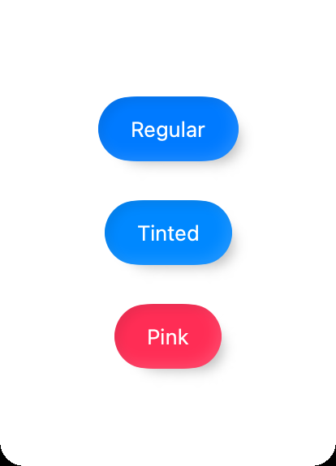

### Toggle

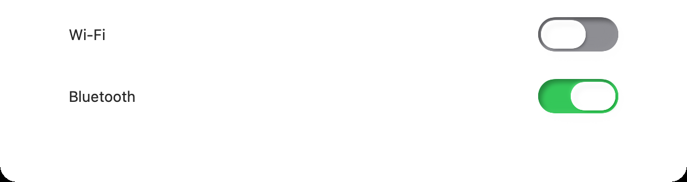<br>


### Gauge

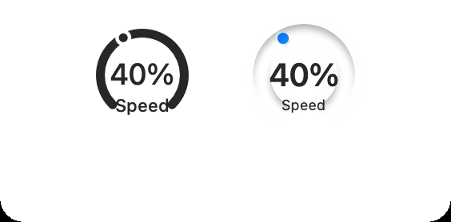<br>
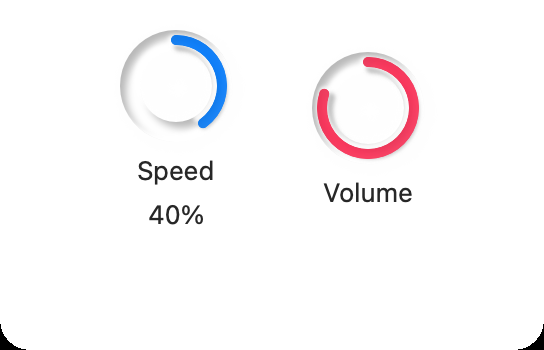

### ProgressView

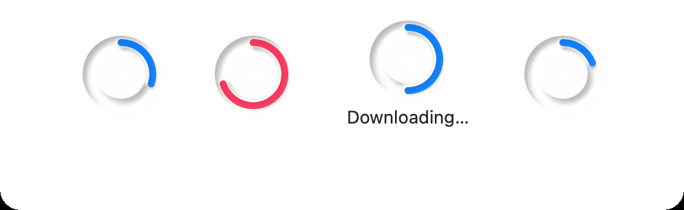<br>
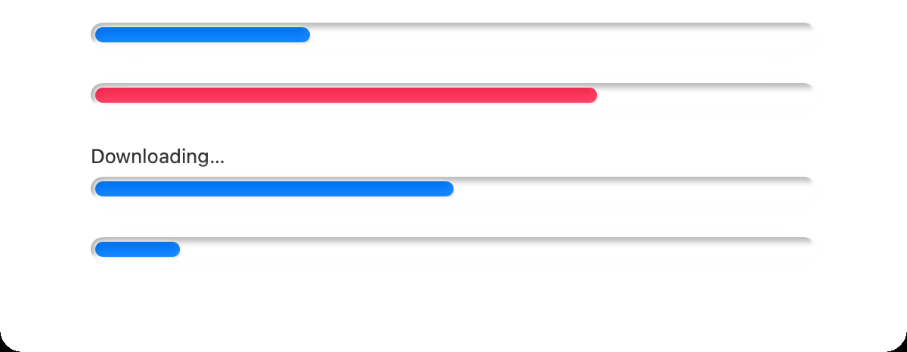

### GroupBox / DisclosureGroup

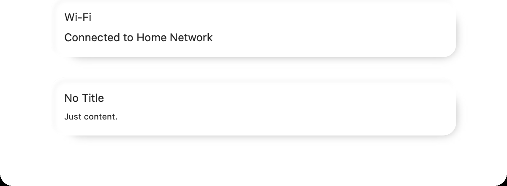<br>
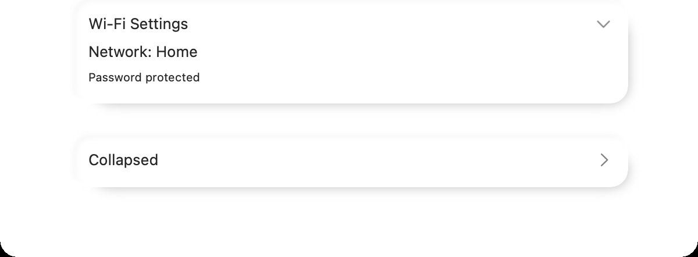

### TextEditor

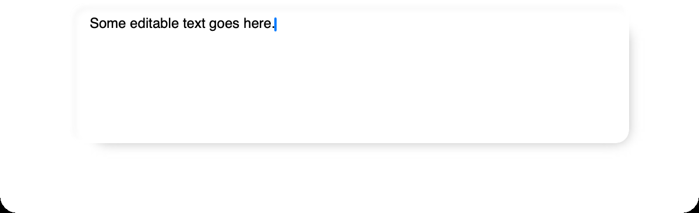

### ControlGroup

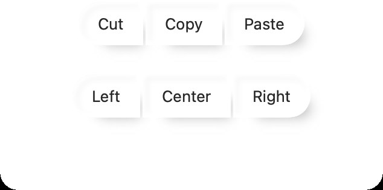

### Form

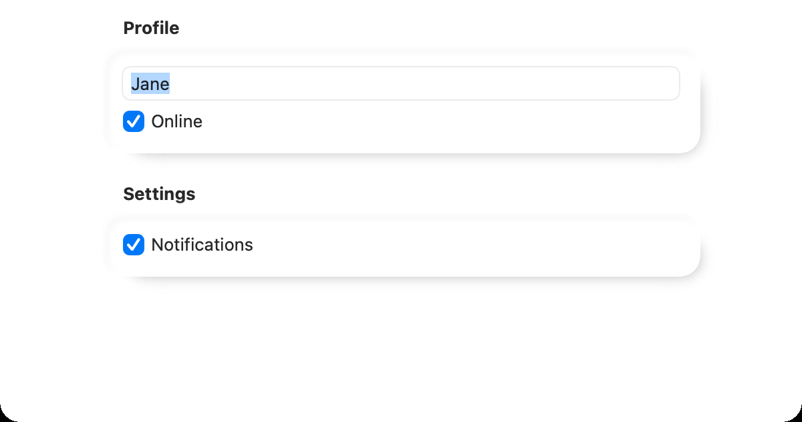

### DatePicker

<br>
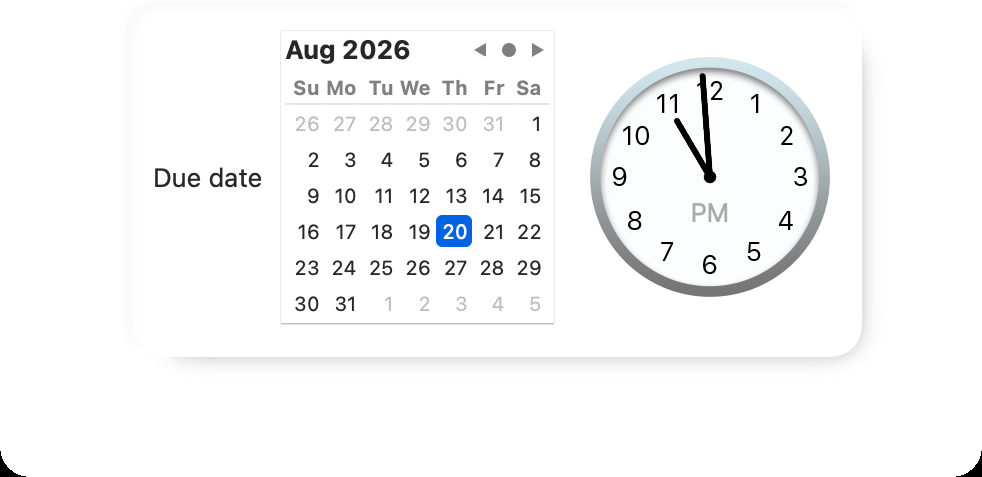

## Usage

Apply a bundled style with the same `.styleName(.neumorphism...)` syntax you'd use for any built-in SwiftUI style:

```swift
import SwiftUI
import Neumorphism

struct ContentView: View {
    @State private var isOn = true
    @State private var progress = 0.4

    var body: some View {
        VStack(spacing: 24) {
            Button("Continue") { }
                .buttonStyle(.neumorphismProminent)
                .tint(.blue)

            Toggle("Wi-Fi", isOn: $isOn)
                .toggleStyle(.neumorphismSwitch)

            ProgressView(value: progress)
                .progressViewStyle(.neumorphismLinear)
        }
        .padding()
    }
}
```

You can also apply the underlying `Neumorphism` material directly to any shape, the same way you'd use `glassEffect(_:in:)`:

```swift
Text("Hello, World!")
    .font(.title)
    .padding()
    .neumorphismEffect(.regular, in: .rect(cornerRadius: 20))
```

## Available styles

| SwiftUI protocol | Bundled styles |
| --- | --- |
| `ButtonStyle` | `.neumorphism`, `.neumorphismProminent` |
| `ToggleStyle` | `.neumorphism`, `.neumorphismSwitch`, `.neumorphismCheckbox` (macOS only) |
| `GaugeStyle` | `.neumorphism`, `.neumorphismCircular` (watchOS only), `.neumorphismLinear` (watchOS only), `.neumorphismLinearCapacity`, `.neumorphismAccessoryCircular`, `.neumorphismAccessoryCircularCapacity`, `.neumorphismAccessoryLinear`, `.neumorphismAccessoryLinearCapacity` |
| `ProgressViewStyle` | `.neumorphismCircular`, `.neumorphismLinear` |
| `GroupBoxStyle` | `.neumorphism` |
| `DisclosureGroupStyle` | `.neumorphism` |
| `TextEditorStyle` | `.neumorphism`, `.neumorphismRoundedBorder` (visionOS only) |
| `ControlGroupStyle` | `.neumorphism` |
| `FormStyle` | `.neumorphism` (renders each `Section` as its own card on iOS 18/macOS 15/tvOS 18/watchOS 11/visionOS 2 and later; falls back to a single card on older versions) |
| `DatePickerStyle` | `.neumorphism`, `.neumorphismCompact`, `.neumorphismField` (macOS only), `.neumorphismGraphical`, `.neumorphismStepperField` (macOS only), `.neumorphismWheel` (iOS/watchOS only) |

Each style's doc comment explains exactly which real system style it mirrors and why its availability is restricted the way it is.

## Documentation

This package ships a [Swift-DocC](https://www.swift.org/documentation/docc/) catalog (`Sources/Neumorphism/Neumorphism.docc`) covering every style, organized by SwiftUI protocol. In Xcode, build it with **Product > Build Documentation**, or generate it from the command line with the bundled [swift-docc-plugin](https://github.com/apple/swift-docc-plugin):

```sh
swift package generate-documentation
```

## Installation

Add this package to your project through Swift Package Manager. In Xcode, use **File > Add Package Dependencies…** and enter the repository URL, or add it to your `Package.swift`:

```swift
dependencies: [
    .package(url: "<repository URL>", from: "1.0.0")
]
```

> This package hasn't been published yet — replace `<repository URL>` once it has a home.

## Contribution

See [CONTRIBUTING.md](CONTRIBUTING.md) if you want to make a contribution.

## Licence

See [LICENSE](LICENSE).

## Author

[Keisuke Chinone](https://github.com/KC-2001MS)
